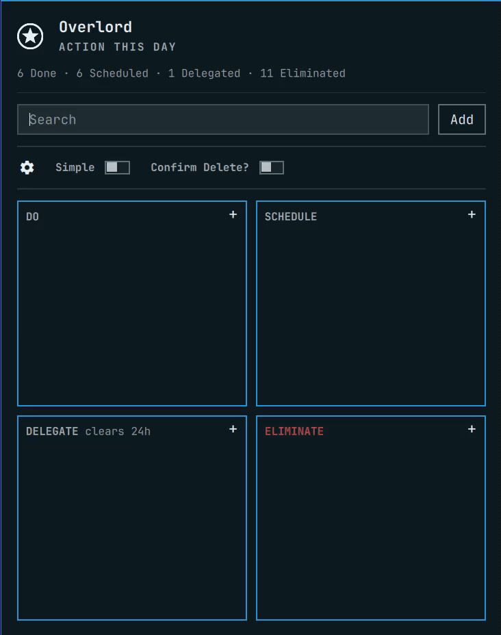
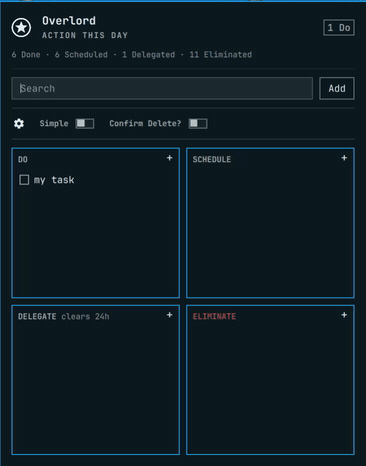
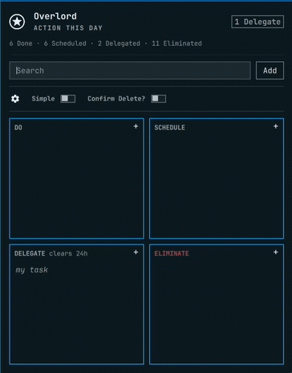
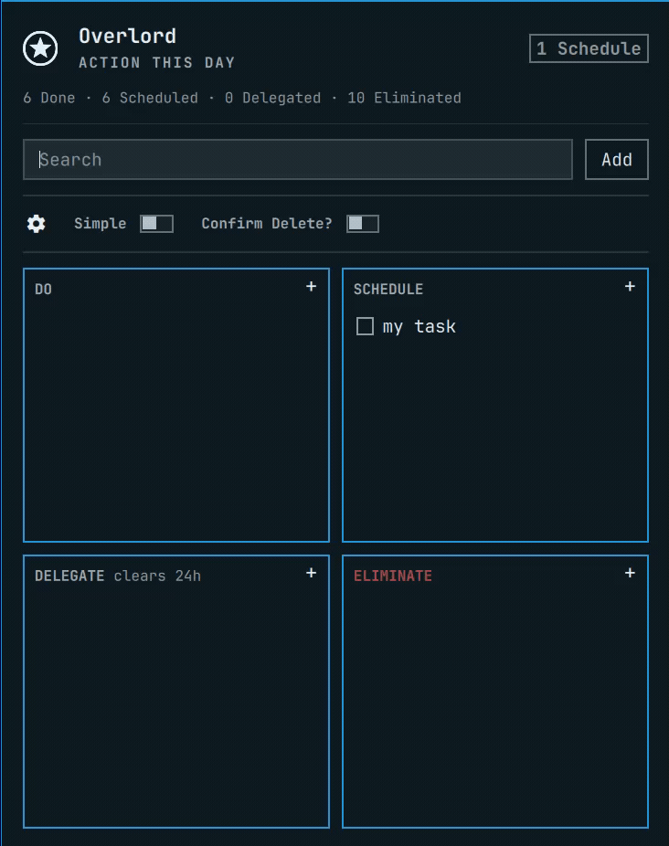
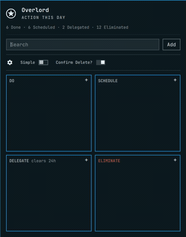
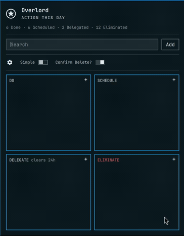

<p align="center">
  
</p>

# Overlord

Overlord is an Omarchy shell plugin that provides local notes and task tracking. It is based on the Eisenhower Matrix ([Wikipedia](https://en.wikipedia.org/wiki/Time_management#Eisenhower_method)), sometimes called an Eisenhower Decision Matrix, Eisenhower Box, or Urgent-Important Matrix.

> The Eisenhower Matrix is a productivity, prioritization, and time-management tool designed to help you prioritize a list of tasks by categorizing them according to their urgency and importance. The name was coined by Stephen Covey, the author of *The 7 Habits of Highly Effective People*, who took inspiration from a speech given by Dwight D. Eisenhower, the 34th President of the United States. Eisenhower quoted an unknown university president during a speech, stating, “I have two kinds of problems: the urgent, and the unimportant. The urgent are not important, and the important are never urgent.”

_Source: Columbia University School of Professional Studies, Academic Resource Center. (2023). *[The Eisenhower Matrix](https://sps.columbia.edu/sites/default/files/2023-08/Eisenhower%20Matrix.pdf)*._

## Contents

- [Usage](#usage)
- [Install](#install)
- [Managing notes](#managing-notes)
- [Managing config](#managing-config)
- [Remove](#remove)

## Usage

Click the star. The board opens under the icon, the same way other bar plugins do. 

Add a note and it lands in Do to begin with.



Drag it to Schedule, Delegate, or Eliminate, according to the Eisenhower method and to apply a classification to the task.



Eliminate will delete immediately unless Confirm is toggled on.



Delegate drops it after 24 hours.



Simple hides Delegate and Eliminate and offers up a basic 2-pane task categorisation view.



Search filters the cards in place. Each pane shows about 10 notes before it starts scrolling. To configure the storage location for your notes, click the settings icon:



## Install

```sh
omarchy plugin add https://github.com/lwade/omarchy-overlord.git --enable
```

No extra packages. The plugin uses the Omarchy shell only. License: MIT.

## Managing notes

Back up the board by copying one file. It holds the notes, the Simple and Confirm Delete toggles, and the counters:

```text
$XDG_DATA_HOME/omarchy-overlord/overlord.json
```

If `XDG_DATA_HOME` is unset, that is `~/.local/share/omarchy-overlord/overlord.json`.

To move the board to another machine, install the plugin, put the file at the same path, then run `omarchy restart shell`. A replaced file is not picked up until the shell restarts.

To keep the notes in another folder, such as one mounted from cloud storage, use the folder button on the board. The file name stays `overlord.json`. Notes already in the old folder stay there until you copy them. An older `board.json` in the chosen folder is read once and saved as `overlord.json`.

## Managing config

The toggles travel with the notes file, so a copy of `overlord.json` backs those up too.

The notes folder is a separate setting, `notesDir`, in `~/.config/omarchy/shell.json`. Empty means the default path above. It is not inside the notes file, so the plugin can still find `overlord.json` after you move it. Copy `shell.json` if you want the same notes folder and bar placement on another machine.

The installed plugin under `~/.config/omarchy/plugins/io.github.lwade.overlord` is the program, not your notes.

## Remove

```sh
omarchy plugin remove io.github.lwade.overlord
```

The board file is left in place.
